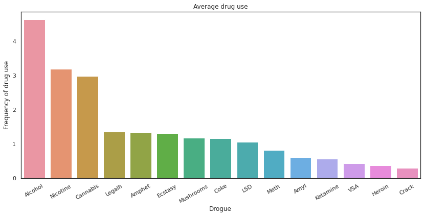
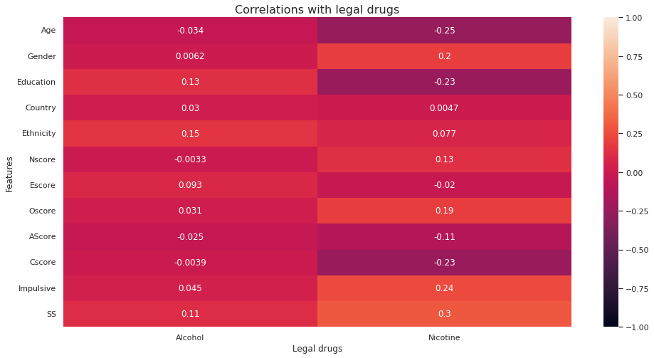
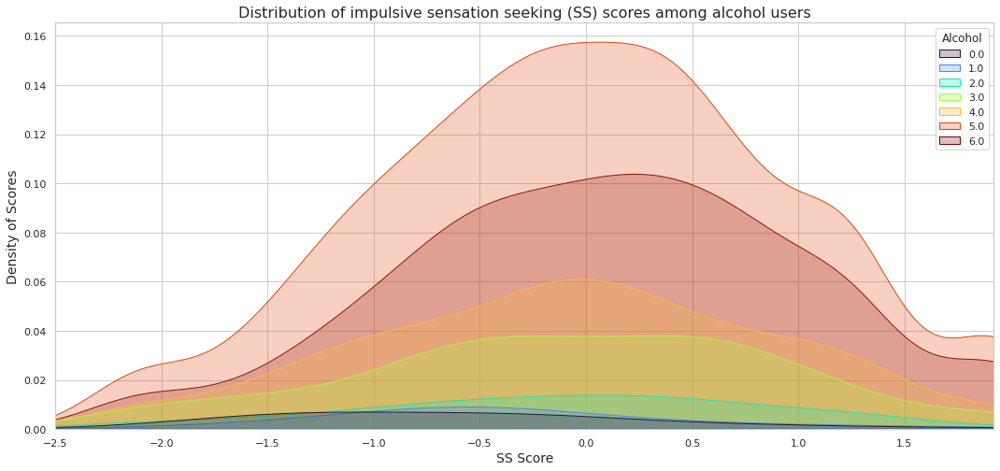
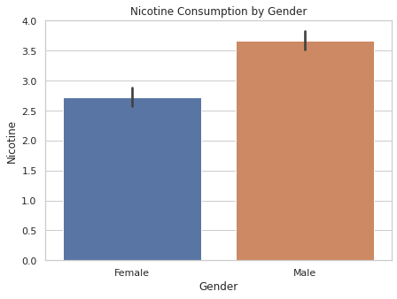
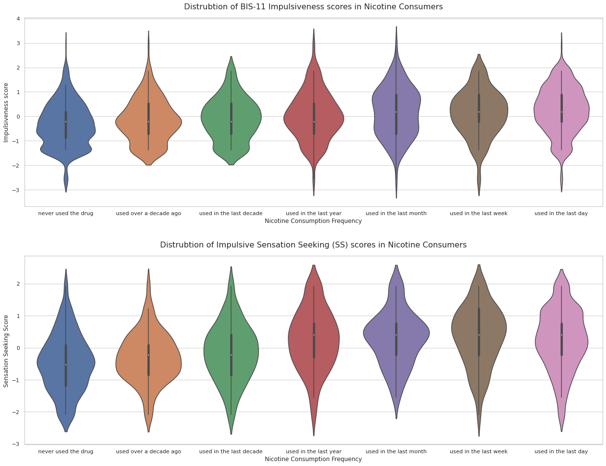
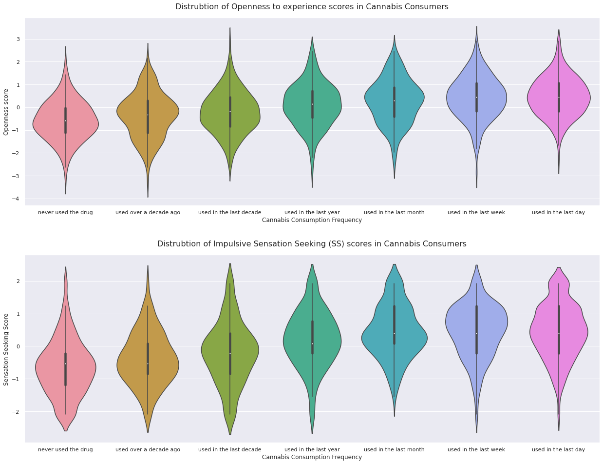
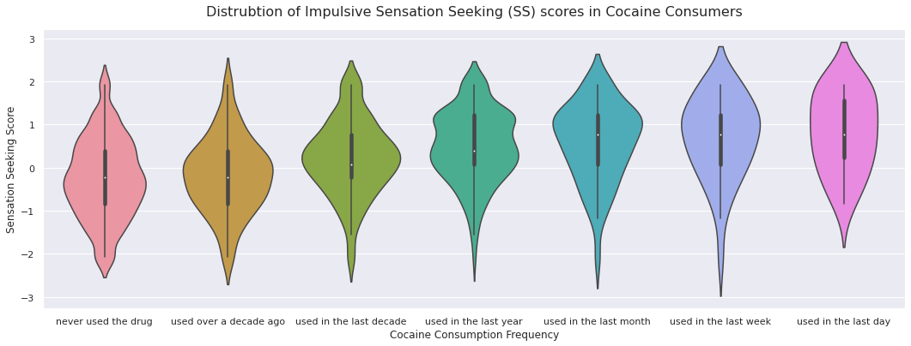

# AddicTest
AddicTest is a Django application that offers an interactive tool that allows users to predict the risk of addiction using Machine Learning models.  

The data used consists of several features such as collected personal information and psychological test results. As well as the level of legal and illegal drug use of more than 1880 participants, such as alcohol, nicotine, cannabis, cocaine, crack, ecstasy, heroin, etc.


## Data Analysis

### Overview

Different drugs have different effects on people and these effects are influenced by many factors. This makes them unpredictable and dangerous, especially for young people.

Effects of each drug are influenced by the following :
1. The type of drug
2. Amount of consumption
3. What the person is doing while using the drugs
4. Individual characteristics such as body size and health/psychological vulnerabilities
5. How many different drugs are taken at one time  
</br>



As expected, we find that alcohol, nicotine and cannabis are the most used drugs, as they are the most widely available, whether in legal or illegal markets.

### Legal Drugs



- A **slight positive correlation** between **Nicotine** and **Sensation Seeking (SS)** score, as well as a less pronounced correlation with **Impulsivity**, **Oscore** and **Sex**.
- A **slight negative correlation** between **Nicotine** and **Age**, **Education** and **Cscore**.
- A **weak positive correlation** between **Alcohol** and **Sensation Seeking (SS)**, as well as **Ethnicity** and **Education**.
- Overall, the level of correlation between personal information and Alcohol are less pronounced than their level of correlation with Nicotine.

#### Alcohol



> _Drug Use Index :_
**0 :** Never used  
**1 :** Used over a decade ago  
**2 :** Used in the last decade  
**3 :** Used within last year  
**4 :** Used in the last month  
**5 :** Used in the last week  
**6 :** Used in the last day 

Frequent alcohol drinkers tend to have higher Sensation-Seeking (SS) scores, such that a majority of non-drinkers ("never drank" or "drank more than ten years ago") had an SS score close to -1.0 while frequent drinkers ("consumed a week ago" or "a day ago") tended to score between 0 and 0.25.

#### Nicotine



Nicotine shows a marked difference in consumption between the sexes, with men consuming more nicotine than women.



Nicotine consumption is positively correlated with both impulsivity score and SS score. With a slightly more pronounced relationship in Sensation Seeking (SS) scores.


### Illegal Drugs

A drug is classified as ‘illegal’ if it is forbidden by law.


#### Cannabis



Cannabis is positively correlated with SS. People who never or rarely used any of the illegal drugs showed SS scores of -0.5 to -1.0, while frequent users' scores ranged between 0.5 and 1.5.  
Cannabis also showed a positive correlation with openness to experience (Oscore), with scores for most occasional and infrequent users ranging from 0 to -0.5 while the most frequent users had scores ranging from between 0.5 and 1.0.

#### Cocaine



Cocaine is positively correlated with SS. People who never or rarely used any of the illegal drugs showed SS scores of -0.5 to -1.0, while frequent users' scores ranged between 0.5 and 2.

### Final conclusion

Since Sensation Seeking (SS) Score appeared to have the highest positive correlation for all drugs (legal & illegal), it may be the most robust measure of personality to predict drug use.  
This personality score can help us better understand those who are the most at risk of drug abuse or drug use in general, which can provide physicians and therapists with a clearer and more nuanced understanding of this population.

## Drug use prediction

### Feature Engineering

- After Data Analysis the following features were the most useful for the predicting drug use : **Ethnicity, Nscore, Escore, Oscore, Cscore, Impulsive, SS**.
- Because our database contains a small number of sample for each 'drug use index', we labeled all indexes above 2 as drug user (1) and indexes 0 & 1 as non drug user (0).

### Prediction

After training different models (Naive Bayes, Random Forest, SVM, Logistic Regression), we found that applying cross-validation to **Logistic Regression** to find the best parameters produces the best results.  

**Drugs with low accuracy & F1 score :** Crack, Heroin, VSA.  
**Drugs with accuracy & F1 score above 60% :** Amphet, Cocaine, Ecstasy, Mushrooms.  
**Drugs with accuracy & F1 score above 80% :** Alcohol [97%], Cannabis [85%], Nicotine [80%].  

These drugs produced the best results because they are the most widely used by individuals in the data set, and therefore it contains the most number of samples to accurately train the model.

``` Python
from sklearn.linear_model import LogisticRegression
from sklearn.model_selection import GridSearchCV

tuned_parameters = [
    {
        "solver" : ['liblinear'], 
        "multi_class" : ['ovr'],
        "class_weight" : [None, 'balanced'],
        "max_iter" : [100,200,500,800, 1600]
    },{
        "solver" : ['newton-cg'], 
        "multi_class" : ['ovr','multinomial'],
        "class_weight" : [None, 'balanced'],
        "max_iter" : [100,200,500,800, 1600]  
    }
]
lr_model_cv = GridSearchCV(LogisticRegression(), tuned_parameters, cv=10,scoring='f1')
```
**Outputted parameters :**
```
{'class_weight': 'balanced', 'max_iter': 100, 'multi_class': 'multinomial', 'solver': 'newton-cg'}
```
